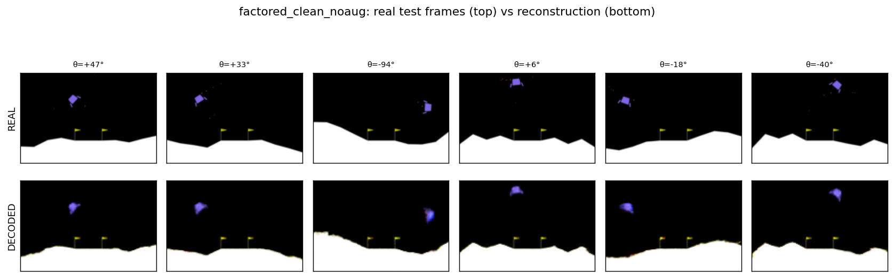
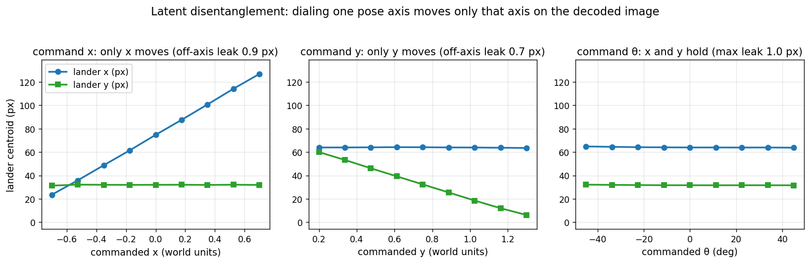

# Factored VAE for Lunar Lander

A small, physically interpretable VAE for Gymnasium Lunar Lander images. Its latent is split into a
physical pose part the you set directly (the lander's x, y, and tilt) and a scene code that carries
the terrain but not the lander. That means the lander's pose can be dialed independently, and the model can
be checked on the image it produces rather than trusted blindly.

This repo is the clean, self-contained path from data → trained VAE → using it. The full write-up is
[`docs/vae_report.pdf`](docs/vae_report.pdf).

## Interactive demo

[`pose_demo.html`](pose_demo.html) is a self-contained browser demo: open it in any browser and drag the
x / y / θ sliders to move and rotate the lander. Nothing to install. (On GitHub, download it and open
locally, or view it live at the GitHub Pages URL if Pages is enabled for this repo.)

## Results at a glance

Reconstruction on held-out test frames (real on top, the model's decode on the bottom):



Dialing one pose axis moves only that axis on the decoded image, with at most about a pixel of leak onto the
others:



Tilt is controllable to about ±45°; beyond that the lander distorts rather than rotating. Full analysis and
limitations are in [`docs/vae_report.pdf`](docs/vae_report.pdf).

## What's here

```
READ THESE
  docs/vae_report.pdf       the write-up (architecture, training, analysis)
  docs/TRAINING.md          how the VAE was trained: the 3-stage chain, loss, commands
  pose_demo.html            interactive slider demo (open in a browser)
  03_vae_and_sincos.ipynb   notebook that explains the VAE and reconstructs test frames

RUN THESE
  example_use.py            load the shipped VAE and use it (reconstruct + generate)
  reproduce.sh              retrain from scratch (data -> stage 1 -> 2 -> 3), then verify
  verify.py                 check a retrained checkpoint reproduces the shipped one
  generate_data.py          regenerate equivalent Lunar Lander data (if you don't have it)
  build_pose_demo_html.py   rebuild pose_demo.html (e.g. from a reproduced checkpoint)

THE CODE
  train_theta_branch_vae.py   stage 1 trainer (base VAE + tilt reader)
  train_position_equiv.py     stage 2 trainer (position control)
  train_factored_vae.py       stage 3 trainer (the shipped, factored model)
  train_clean_vae.py  factored_data.py  zlander_recon_fig.py   model + data loaders
  config.py  checkpoints.py  controllability.py  geom_theta.py   supporting code
  piwm_model/                 the model, mask, and data helpers (see Attribution)

DATA
  checkpoints/                the trained weights (factored_clean_noaug_best.pt) + manifest
  figures/                    figures used in the report and notebook
```

## Setup

```bash
python3.10 -m venv .venv
.venv/bin/pip install -r requirements.txt
```

## The data

The dataset was provided by the team (not generated in this project), so two ways to get data to run
against:

- **You have the dataset (the team):** set `PIWM_DATA_ROOT` to a folder containing `lunartrain/` and
  `lunartest/` of `<i>.npz` episodes (keys `imgs`, `acts`, `states`). No manual filtering needed: the
  training code filters to fully-visible frames and carves the validation split by itself, so the same raw
  episodes give the same training set.
- **You don't have it (anyone else):** `pip install "gymnasium[box2d]"`, then
  `python generate_data.py --n_train 345 --n_test 55 --out ./data/lunar` and set
  `PIWM_DATA_ROOT=./data/lunar`. This makes the same folder structure with random-action episodes.

## Use it

**Just run it** (the fastest way to see it work: reconstruct real frames and generate from a chosen pose):

```bash
python example_use.py
```

### Use the shipped weights in your own project

The `.pt` file alone is not loadable: you need the model class (`PiwmConvVAE`), so take the *code* too,
not just the weights. Either clone this repo and import from it, or copy into your project:
`checkpoints/factored_clean_noaug_best.pt` + `.json`, the `piwm_model/` package, and `config.py`,
`checkpoints.py`, `zlander_recon_fig.py`. Then:

```python
import torch
from zlander_recon_fig import load
dev = torch.device("cuda" if torch.cuda.is_available() else "cpu")
m = load("factored_clean_noaug_best", dev)   # builds PiwmConvVAE + the tilt reader, loads the weights
vae = m["vae"]

# GENERATE from a pose: assemble a 32-dim latent z and decode
img = vae.decode(z)          # z: (B, 32)  ->  image (B, 3, 100, 150), values in [0, 1]
```

Two things you need to drive it correctly:
- **Latent layout:** `z[0:2]` = (x, y), `z[2:4]` = (cos θ, sin θ), `z[4:]` = the scene code.
- **Pose is *injected*, not encoded.** At inference, x and y are read off the image (the lander's centroid
  mapped to world units) and tilt from the small CNN reader; the encoder itself only produces the scene code.
  So encoding a real frame is a small pipeline (erase the lander → encode the scene → inject the pose). See
  `build_z()` in `zlander_recon_fig.py` and `example_use.py` for the full path. Background in `docs/vae_report.pdf`
  and `docs/TRAINING.md`.

## Reproduce and verify

With `PIWM_DATA_ROOT` set:

```bash
bash reproduce.sh                     # trains stage 1 -> 2 -> 3 from scratch, then verifies
python verify.py factored_reproduce_best   # (reproduce.sh calls this for you)
```

`reproduce.sh` saves the retrained model as `factored_reproduce` so it never overwrites the shipped weights.
A full run takes hours on a laptop GPU; `SMOKE=1 bash reproduce.sh` is a fast end-to-end plumbing check.
`verify.py` passes when the retrain matches the shipped model (bit-for-bit on the same GPU, or key metrics within tolerance
on different hardware), and it flags a genuinely broken run. Full details in
[`docs/TRAINING.md`](docs/TRAINING.md).

To see a reproduction work interactively, rebuild the demo from your checkpoint and drag the sliders:

```bash
PIWM_MODEL=factored_reproduce_best python build_pose_demo_html.py   # writes pose_demo_factored_reproduce_best.html
```

## Reproducibility

`config.SEED = 0` seeds Python, NumPy, and Torch; `checkpoints.enable_determinism()` sets deterministic
cuDNN / cuBLAS flags. Runs reproduce bit-for-bit on the same machine; across GPUs, `verify.py` checks results
within tolerance. Validation is split off by whole episode; the test split is never used for selection.

## Attribution

- The vendored `piwm_model/` package and the VAE design build on the 4-Principles physically interpretable
  world model (arXiv:2503.02143).
- Environment: Gymnasium `LunarLander-v3` (Box2D).
