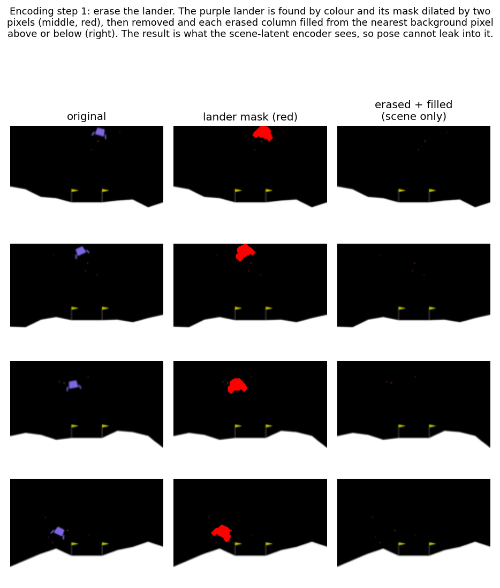
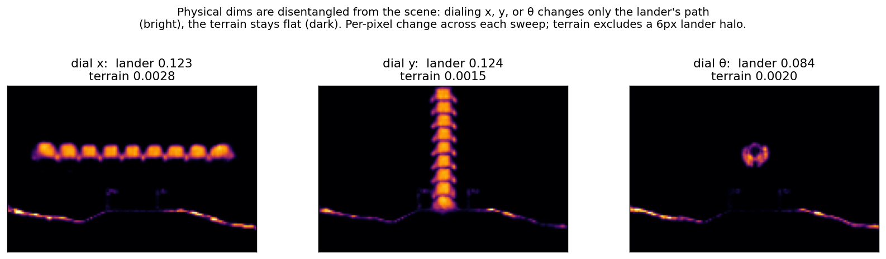

# Factored VAE: training and analysis

## Summary

- **What it is.** A factored VAE for the Gymnasium LunarLander images: the lander's pose is held in named
  latent dimensions (x, y, cos theta, sin theta) that are set directly, while the rest of the latent is a
  "scene latent" that carries the terrain but not the lander body. Splitting the latent this way makes the pose
  directly controllable and checkable, and lets the scene be carried (and held fixed) separately from the
  moving lander.
- **Trained in three stages, run in order.** Stage 1 trains a base VAE plus a tilt reader (a small CNN) from
  scratch. Stage 2 adds position control: a swap-equivariance objective that forces the decoder to place the
  lander where the position dimensions command, not merely where the encoder happened to put it. Stage 3
  fine-tunes with the lander erased from the image before encoding, so the scene latent holds terrain only,
  injects the pose directly into its latent slots, and adds a tilt-swap objective that sharpens the tilt dial.
- **How the stages combine and are selected.** Stages 2 and 3 are warm-started (they continue from the
  previous stage's best-validation weights; stage 1 is from scratch), so each stage keeps what was learned and
  adds one objective. Every stage uses early stopping and restores its best-validation epoch, and the factored
  stage additionally requires the epoch to be controllable (the decoder must render the lander and move it on
  command) before it can be selected. Seed 0, selected on a held-out validation split and evaluated on a
  separate held-out test split, no augmentation.
- **Losses.** A reconstruction term (pixel MSE, an edge term, and SSIM) that up-weights the lander's pixels (in
  the MSE and edge parts) so the small lander is not drowned out by the much larger terrain; a light KL that
  regularizes the scene latent; supervision tying the pose dimensions to the true state (injected directly in
  stage 3); and the swap-equivariance terms that make position and tilt controllable.
- **Position is well separated.** Dialing one pose axis moves mainly that axis, with at most about a pixel of
  unwanted movement on the others, and disturbs the terrain only slightly.
- **Tilt is controllable in a central band.** Dialing tilt rotates the lander across the central plus or minus
  45 degrees; beyond that the lander distorts rather than rotating to the commanded angle.

## Architecture

A 32-number latent, about 2.8 million parameters. The encoder and decoder are small convolutional networks,
and the tilt reader (below) is a separate small CNN. The first four numbers are the physical pose and are set
directly rather than learned from a loss: `z[0]=x`, `z[1]=y`, `z[2:4]=(cos theta, sin
theta)`. The remaining numbers `z[4:]` are the scene latent: a learned code for everything that is not the
lander (mainly the terrain), encoded from a lander-erased image so it does not carry the pose (bar a
negligible thrust-flame remnant noted in Limitations). Tilt is stored
as a (cosine, sine) pair rather than a raw angle, to avoid the jump between +180 and -180 degrees. This factored structure separates a physically-interpretable
pose part from a separately-encoded scene latent.

**How a frame is encoded and decoded.** The latent splits into a pose part `z[0:4]` and a scene latent
`z[4:]`. Encoding a frame into that latent (the shipped model's forward pass, used in stage-3 training and at
inference; stages 1 and 2 encode the full frame and build up to it) takes four steps:

1. Erase the lander from the frame: find its pixels by colour (the largest connected purple region, dilated by
   two pixels to catch the soft edge the colour threshold misses), remove them, and fill the hole with a
   vertical nearest-background fill (copy the nearest non-lander pixel above or below into each erased column),
   leaving a scene-only image.
2. Encode that scene-only image into the scene latent `z[4:]`. The lander is already gone, so the scene latent holds
   terrain only and never sees the lander.
3. Inject the position: read (x, y) off the image, the lander's centroid mapped to world units, and write it
   into `z[0:2]`.
4. Inject the tilt: write the (cos, sin) tilt, read by the tilt reader (the stage-1 CNN), into `z[2:4]`.

Writing a value straight into a pose slot (steps 3 and 4), rather than letting the network produce it, is
what *injecting* means here; the encoder produces only the scene latent `z[4:]`.

Decoding is the reverse and never erases anything: the decoder takes the assembled latent and draws the full
frame at once, the lander (from `z[0:4]`) on the terrain (from `z[4:]`). There is no paste-back step; the
decoder regenerates the whole image, having learned during training to place the lander where the pose
numbers say.

Two notes. Tilt gets a learned reader because reading an angle off an image is hard (the wrap at +/-180
degrees and the head/feet ambiguity); position needs none, since (x, y) is just the lander's centroid, which
matches the recorded label to about 0.03 (R^2 about 0.9999). So position is read straight off the image at
inference, with no ground truth. The erase happens only when encoding a real frame: generating from a chosen pose (dialing a slider, rolling the dynamics) goes straight to
the decoder.

## How it was trained

**Overview.** The model is built in three stages, run in order. Stage 1 is trained from scratch; stages 2
and 3 are each *warm-started* from the previous stage's best-validation weights, meaning training begins from
those trained weights rather than from random initialization, so each later stage keeps what was already
learned and adds one new objective. Only stages 2 and 3 take a warm-start checkpoint; stage 1 has none.
Every stage holds out the same validation episodes and restores the best-validation epoch at the end (early
stopping), and the test split is never used to pick a model. For the factored stage, selection is additionally
gated on controllability: only epochs whose decoder renders the lander for at least 80 percent of commanded
poses and moves it by at least a set threshold when position is dialed are eligible to be the best-validation
checkpoint, so the shipped model is the best-reconstructing epoch among those that are controllable. The
shipped epoch clears this comfortably: it renders the lander for every commanded pose (100 percent) and moves
it about 101 px in x and 55 px in y.

The latent is read throughout as `z[0:2]` = (x, y), `z[2:4]` = (cos theta, sin theta), `z[4:]` = scene latent.

**Loss terms.** Six terms appear across the three stages. Each is defined once here; every per-stage loss
below is built only from these.

- **recon**: the reconstruction loss, `recon = 1.0*MSE + 1.0*edge + 0.5*SSIM`. The MSE and edge terms apply a
  pixel weight `w = 25` on the lander's purple-segmented pixels (and `w = 1` elsewhere), so the small lander is
  not drowned out by the much larger terrain; SSIM is taken over the whole image, unweighted. The same recon
  term is used in all three stages.
    - **MSE** (term weight 1.0): the lander-weighted mean squared error between reconstructed and true
      pixels, `MSE = sum(w * (recon - target)^2) / sum(w)` summed over all pixels.
    - **edge** (term weight 1.0): penalizes blur by matching *image gradients*, how sharply brightness
      changes between neighbouring pixels (lander pixels weighted 25 times). It is the lander-weighted mean of
      `(gx(recon) - gx(target))^2 + (gy(recon) - gy(target))^2`, where `gx, gy` are the differences between
      horizontally and vertically neighbouring pixels, so a blurred edge (wrong gradients) is punished and
      the lander outline and terrain silhouette stay crisp.
    - **SSIM** (term weight 0.5): the structural-similarity index, used as `1 - SSIM`, over the whole image
      (not lander-weighted), a standard perceptual metric over small Gaussian windows that compares local
      luminance, contrast, and structure rather than single pixels. With `mx, my` the local means of the
      reconstruction and target, `vx, vy` their local variances, and `cxy` their covariance,
      `SSIM = (2*mx*my + C1)(2*cxy + C2) / ((mx^2 + my^2 + C1)(vx + vy + C2))`, with `C1 = 0.01^2` and
      `C2 = 0.03^2`.
- **KL** (weight 1e-4): regularizes only the scene-latent dimensions `z[4:]`, pulling their distribution
  toward a standard normal so the latent space stays smooth. With `mu` and `logvar` the encoder's mean and
  log-variance on those dims, `KL = -0.5 * mean(1 + logvar - mu^2 - exp(logvar))`.
- **xy** (weight 1.0): encoder position error, the mean squared error forcing the encoded `z[0:2]` to match the
  true (x, y): `xy = mean( (z[0:2] - (x, y))^2 )`. Active in stages 1 and 2; dropped in stage 3, where x and y
  are injected directly.
- **tilt** (weight 1.0): mean squared error on (cos theta, sin theta), never on the raw angle. With `p` the
  tilt reader's output and `t = (cos theta, sin theta)` the true pair, `tilt = mean( (p - t)^2 )`. In stage 1
  it trains the tilt reader; afterwards it keeps tilt accurate. Called `theta_state` in the code.
- **position-swap** (weight 2e-4): position swap-equivariance. Swap a position value (x, then separately y)
  between two frames' latents, decode, and require each lander to move to the commanded spot. With `M` the
  lander's pixel mask on the decoded image, `(tx, ty)` the commanded target pixel, and `(x, y)` pixel
  coordinates, the term is the mask-weighted mean squared distance of the lander's pixels from the target,
  `position-swap = sum( M * ((x - tx)^2 + (y - ty)^2) ) / sum(M)`, so a small value means the lander is
  concentrated at the target rather than smeared into haze. Phased in over 8 epochs.
- **tilt-swap** (weight 1.0): the tilt analogue of the position-swap. Dial a commanded tilt into `z[2:4]`, decode, and
  read the decoded lander's tilt back with a frozen copy of the tilt reader; that readback `r` must match the
  commanded `c`: `tilt-swap = mean( (r - c)^2 )`. Phased in over 8 epochs.

Each stage's loss builds on the previous one. Colour marks where a term first enters:
blue = added in stage 2,
green = added in stage 3.

**Stage 1, base VAE and tilt reader (from scratch).** The goal is a working autoencoder plus a reliable tilt
readout: the backbone the later stages refine. A fresh VAE learns to reconstruct the frame, its
encoder is supervised to put (x, y) in `z[0:2]`, and a small CNN, the tilt reader, learns to read
(cos theta, sin theta) from a 24x24 crop centred on the lander (about half a degree error on held-out
crops). It carries forward the VAE and tilt-reader weights. This learned tilt reader is a different thing
from the geometric, PCA-based tilt reader used in the results below to measure the decoded output; that one
belongs to the constraint checker, not the model.

**L1** = recon + 1e-4 KL + 1.0 xy + 1.0 tilt

**Stage 2, position control (warm-started from stage 1).** The goal is to make position controllable, so the
decoder puts the lander wherever `z[0:2]` says, not merely where the encoder happened to store it. Beginning
from stage 1's weights, the
position-swap term is added so the decoder learns to place the lander where `z[0:2]` commands and not only
where the encoder put it. It carries forward the VAE and tilt-reader weights.

**L2** = recon + 1e-4 KL + 1.0 xy + 1.0 tilt + 2e-4 position-swap

**Stage 3, factored scene-only fine-tune (warm-started from stage 2).** The goal is to
separate pose from scene, forcing the scene latent to hold terrain only and injecting the pose so the two are
disentangled, and to sharpen the tilt dial. Beginning from
stage 2, the split is made hard: the scene latent `z[4:]` is now encoded from the lander-erased image so it
is largely cleared of the lander, x and y are injected (written straight into `z[0:2]`) from the
known state during training rather than produced by the encoder, and the tilt-swap term sharpens the tilt
dial. Because the position is set rather than learned, the `xy` supervision term is dropped; at inference
these same slots are filled by reading x and y off the image instead (the encode/decode section above). This
stage's checkpoint is the shipped model.

**L3** = recon + 1e-4 KL + 1.0 tilt + 2e-4 position-swap + 1.0 tilt-swap &nbsp; (xy dropped: x, y injected)

**Which terms are active in each stage:**

| loss term | weight | active in |
|---|---|---|
| recon | composite | all stages |
| KL (scene latent `z[4:]`) | 1e-4 | all stages |
| xy (encoder position) | 1.0 | stages 1 and 2 (dropped in 3, x and y injected) |
| tilt (cos, sin theta) | 1.0 | all stages |
| position-swap | 2e-4 | stages 2 and 3 |
| tilt-swap | 1.0 | stage 3 only |

**Training data.** Frames (Gymnasium LunarLander-v3 renders, 100x150 RGB) are restricted to fully-visible
landers: a frame is kept only if the lander is
fully on-screen (its color mask is present and its bounding box touches no image edge). The roughly one third
of frames where the lander is clipped or partly off-screen are dropped, so the model is never trained to
reconstruct a partial lander. The 345 training-folder episodes are split 293 train and 52 validation
(validation fraction 0.15, split by whole episode); the separate lunartest folder is held out entirely and is
what the analysis below is measured on.

**Parameters** (from the shipped manifest `checkpoints/factored_clean_noaug_best.json`):

| parameter | value | parameter | value |
|---|---|---|---|
| latent dim | 32 | KL weight | 1e-4 |
| learning rate | 1e-3 | lander recon weight | 25 |
| batch size | 32 | edge / SSIM weight | 1.0 / 0.5 |
| epochs | 70 max; best epoch 19 | position-equiv weight | 2e-4 |
| min epochs / patience | 20 / 8 | tilt-equiv weight | 1.0 |
| val fraction (by episode) | 0.15 | augmentation | none |
| train / val episodes | 293 / 52 | seed | 0 |
| parameters | ~2.8M | val reconstruction error | 0.0048 |

Best epoch 19 is counted from zero (it is the 20th epoch), so it satisfies the 20-epoch minimum; training
continued for the patience of 8 further epochs without improvement, then restored these best-validation
weights.

Augmentation is none; the only augmentation tested (synthetically relocating the lander across the frame)
showed no meaningful improvement and was dropped.

The optimizer is Adam. Gradient clipping by norm is applied in every stage and tightened as the swap
objectives phase in (1.0, then 0.5, then 0.3) to keep the warm-started stages from diverging; the learning
rate is 1e-3 in stage 1 and lowered to 5e-4 for the warm-start.

## Results

All figures and numbers below are computed on the held-out lunartest episodes, which are used for neither
training nor model selection. The validation error quoted elsewhere (0.0048) is the reconstruction loss on the
separate validation split that selected the checkpoint, not a test number.

**Reconstruction.** Real test frames (top) and the model's reconstruction (bottom). Position and the
per-frame terrain are recovered: the scene latent encodes the terrain, so it changes frame to frame
(validation-split reconstruction error 0.0048, the selection metric).

**Position is separated from the other axes.** Commanding one pose axis and measuring all three on the
decoded frame: dialing x moves the lander about 104 px in x while y drifts only 0.9 px; dialing y moves it
about 54 px while x drifts 0.7 px; dialing tilt holds x and y within 1.0 px. The unwanted movement on the
axes not dialed stays within a pixel, so the pose axes are well separated.

**Moving the lander barely disturbs the scene.** Holding the scene latent fixed and sweeping each pose
axis, the decoded image changes mostly along the lander's path; the terrain changes only slightly (the
per-pixel change is about 0.002, roughly 50 times smaller than the lander's, with a faint flicker along
the ground edge). So the physical dimensions are largely separated from the scene latent too: dialing x, y, or
tilt moves the lander with only a small change to the terrain. The terrain change is measured outside a 6-pixel halo
around the lander's path, so the moving lander itself is excluded from that number. Each panel below is a map
of where the image changes as that axis is swept (bright = changes, dark = stays put).

**A stage comparison isolates what the erase contributes.** Evaluating the stage-2 checkpoint, whose scene latent
still encodes the full frame with the lander included, against the shipped stage-3 model on the same frames:
both control position equally well (correlation about 1.0 on x and y), so the controllability comes from the
stage-2 swap-equivariance rather than the erase. Erasing the lander from the scene latent is what sharpens the
separation: it roughly halves the off-axis cross-leak (dialing x moves y by 0.9 px rather than 1.8 px, and
dialing y moves x by 0.6 px rather than 1.0 px), bringing it under a pixel, and lowers the scene disturbance
when the lander moves (terrain change 0.0018 versus 0.0024). The cost is reconstruction fidelity (whole-image
error 0.0039 versus 0.0020): the stage-2 scene latent reconstructs the frame partly by keeping the lander in it,
which is the entanglement the erase removes. A complementary test in the other direction (hold the pose fixed
and swap the scene latent in from other frames) agrees: the decoded lander moves 0.86 px in stage 3, about the
measurement floor, versus 1.93 px in stage 2, so the scene latent carries far less pose, though not exactly
zero (the thrust remnant remains).

This separation is also what lets a dynamics model roll only the four physical dimensions forward in time
while the scene latent is held fixed, so the terrain need not be predicted and does not drift as the pose
evolves.

**Tilt is controllable in the central band.** Dialing tilt across plus or minus 45 degrees, the decoded
lander rotates with the command; beyond plus or minus 45 degrees the lander distorts rather than rotating to
the command. A
geometric (PCA) measurement of the decoded tilt (the constraint checker's reader, not the CNN above) tracks
the command near one-to-one within the band, with a slope around 0.8 to 1.0 across base frames; the spread is
mostly the reader's noise on the small decoded lander rather than the decoder, so an exact slope is not a
reliable single number. Tilt is the weakest controlled axis, both the hardest to render and the hardest to
read back.

## Limitations

- Tilt is controllable only to about plus or minus 45 degrees; beyond that the lander distorts rather than
  rotating further. The
  cause is data scarcity (large tilts are about 5% of frames), and rotating the training targets to add more
  was not tried, so it is an untested lever rather than a tried-and-failed one.
- The current VAE blurs some fine detail, such as the lander's exact shape and legs. This is partly a
  loss-incentive and capacity effect a better VAE could sharpen (more weight on the small lander and its legs,
  more decoder capacity), and partly the conditional-mean averaging a reconstruction-trained VAE tends toward (it outputs the average
  of the plausible images for a given code, which smooths variable detail), which the later diffusion step
  could also sharpen. Because a refinement step can only work within what the
  decoder can already draw, improving the VAE itself is the more fundamental lever.
- The lander eraser keys on the purple body and deliberately leaves the orange engine-thrust flames, which
  share the warm colour of the pad flags (part of the scene), so removing the thrust risks deleting flags. A
  sliver of lander position can therefore remain in the scene latent. The leak is empirically negligible:
  the pose-to-terrain change of about 0.002 (in Results) already includes it, and the thrust moves only about
  0.6 pixels per frame. A future retrain could remove it by extending the erase mask: a tight colour filter
  (low blue, with red above green) strips the bright thrust without touching the yellow flags, and a
  frame-to-frame motion difference is a simpler way to catch the faded particles, which colour alone separates
  only with difficulty (the faded thrust and the static flags converge in colour).

## Reproducibility

Seed 0 seeds Python, NumPy, and Torch. Determinism is enforced with `torch.use_deterministic_algorithms(True)`,
`torch.backends.cudnn.deterministic = True`, `torch.backends.cudnn.benchmark = False`, and the environment
variable `CUBLAS_WORKSPACE_CONFIG=:4096:8`. The validation set is split off by whole
episodes (so frames from one episode never appear in both train and validation), the test set is held out
of all selection, and the three-stage chain reproduces bit-for-bit on the same machine. The manifest records
the parameter hash and the library and device versions (trained on an RTX 3050 Ti, 4 GB).
